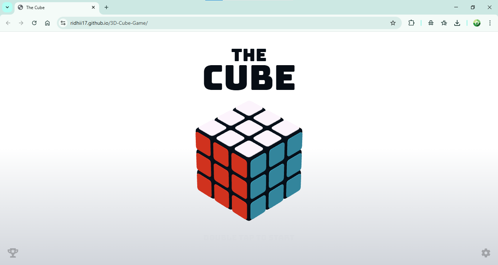

[](https://ridhii17.github.io/3D-Cube-Game/)

# 🧊 3D Cube Puzzle Game

A **3D cube puzzle game** built with [Three.js](https://threejs.org/).  
Play directly in your browser and test your cube-solving skills!

---

## 🌐 Live Demo
👉 [Play the game here!](https://ridhii17.github.io/3D-Cube-Game/)

---

## 📸 Project Preview


---

## ✨ Features
- 🌀 Interactive 3D cube with smooth animations  
- ⏱️ Timer & statistics tracking (best time, average times)  
- 🎨 Customizable cube size, themes, colors, and scramble length  
- 📱 Fully responsive — works on desktop and mobile  

---

## 🚀 How to Run
1. Clone this repo:
   ```bash
   git clone https://github.com/ridhii17/3D-Cube-Game.git
